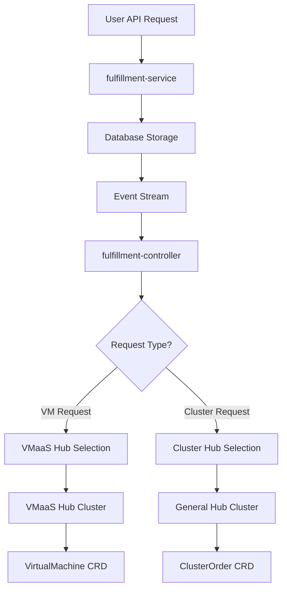

# VMaaS (Virtual Machine as a Service) Hub Management

This document describes how the fulfillment-service and fulfillment-controller handle Virtual Machine requests and route them to dedicated VMaaS infrastructure.

## Overview

The VMaaS system enables routing virtual machine requests to specialized VMaaS-capable clusters, separate from general cluster provisioning. This ensures that VMs are deployed to infrastructure optimized for virtualization workloads.

## Architecture

### Components

1. **fulfillment-service**: Receives VM API requests and stores them in the database
2. **fulfillment-controller**: Processes VM events and routes them to appropriate hub clusters
3. **VMaaS Hub**: Dedicated OpenShift/Kubernetes cluster with virtualization capabilities (kubevirt, CNV, etc.)
4. **Hub Cache**: Controller component that manages connections to multiple hub clusters

### Request Flow



## Hub Types and Capabilities

### Hub Object Schema

Each hub in the system has the following properties:

```json
{
  "id": "vmaas-hub-1",
  "metadata": {
    "creation_timestamp": "2025-01-15T10:30:00Z"
  },
  "kubeconfig": "<base64-encoded-kubeconfig>",
  "namespace": "vmaas-system",
  "capabilities": ["virtualmachines"],
  "hub_type": "vmaas"
}
```

### Hub Types

- **`cluster`**: Handles cluster provisioning requests (ClusterOrder CRDs)
- **`vmaas`**: Handles virtual machine requests (VirtualMachine CRDs)
- **`hybrid`**: Capable of handling both clusters and virtual machines

### Capabilities

- **`["clusters"]`**: Hub can provision clusters
- **`["virtualmachines"]`**: Hub can provision virtual machines
- **`["clusters", "virtualmachines"]`**: Hub supports both workload types

## Configuration

### VMaaS Hub Registration

VMaaS hubs are registered automatically at controller startup if VMaaS configuration is provided. The controller reads the kubeconfig and registers the hub in the fulfillment-service database as a standard hub with VMaaS capabilities.

#### Automatic Registration via Command Line Parameters

```bash
/usr/local/bin/fulfillment-service start controller \
  --vmaas-hub-kubeconfig=/etc/vmaas/kubeconfig \
  --vmaas-hub-namespace=vmaas-system \
  --vmaas-hub-id=vmaas-primary
```

When these parameters are provided:
1. Controller reads the kubeconfig file at startup
2. Creates/updates a hub entry in the database via the Hubs API
3. Sets `capabilities: ["virtualmachines"]` and `hub_type: "vmaas"`
4. Hub becomes available for VM workload routing

#### Manual Registration via Hubs API

VMaaS hubs can also be managed manually using the standard Hubs API:

```bash
# Create VMaaS hub via API
curl -X POST https://fulfillment-api.example.com/api/private/v1/hubs \
  -H "Content-Type: application/json" \
  -d '{
    "id": "vmaas-primary",
    "kubeconfig": "<base64-encoded-kubeconfig>",
    "namespace": "vmaas-system", 
    "capabilities": ["virtualmachines"],
    "hub_type": "vmaas"
  }'
```

## Controller Routing Logic

### VM Request Processing

1. **Event Reception**: Controller receives VM creation event from fulfillment-service
2. **Hub Selection**: VirtualMachineReconciler uses capability-based selection:
   - Selects any hub with `virtualmachines` capability
   - Automatic load balancing across available VMaaS hubs
3. **Resource Creation**: Create VirtualMachine CRD in selected VMaaS hub
4. **Status Updates**: Monitor VM status and update fulfillment-service database

### Cluster Request Processing

1. **Event Reception**: Controller receives cluster creation event from fulfillment-service
2. **Hub Selection**: ClusterReconciler uses capability-based selection:
   - Selects any hub with `clusters` capability
   - Automatic load balancing across available cluster hubs
3. **Resource Creation**: Create ClusterOrder CRD in selected cluster hub
4. **Status Updates**: Monitor cluster status and update fulfillment-service database

## API Usage

### Creating Virtual Machines

```bash
# Create a VM via REST API
curl -X POST https://fulfillment-api.example.com/api/fulfillment/v1/virtual_machines \
  -H "Content-Type: application/json" \
  -d '{
    "spec": {
      "template": "rhel-9-vm-template",
      "template_parameters": {
        "vcpus": {
          "@type": "type.googleapis.com/google.protobuf.Int32Value",
          "value": 2
        },
        "memory": {
          "@type": "type.googleapis.com/google.protobuf.StringValue", 
          "value": "4Gi"
        }
      }
    }
  }'
```

### Creating Clusters

```bash
# Create a cluster via REST API  
curl -X POST https://fulfillment-api.example.com/api/fulfillment/v1/clusters \
  -H "Content-Type: application/json" \
  -d '{
    "spec": {
      "template": "ocp_4_17_small"
    }
  }'
```

## Database Schema

### Hubs Table Structure

```sql
CREATE TABLE hubs (
    id TEXT PRIMARY KEY,
    data JSONB NOT NULL,
    capabilities TEXT[] DEFAULT '{}',
    hub_type TEXT DEFAULT 'cluster',
    created_at TIMESTAMP DEFAULT NOW(),
    updated_at TIMESTAMP DEFAULT NOW()
);

-- Indexes for efficient querying
CREATE INDEX hubs_by_capability ON hubs USING GIN (capabilities);
CREATE INDEX hubs_by_type ON hubs (hub_type);
```

### Sample Hub Records

```sql
-- VMaaS Hub
INSERT INTO hubs (id, data, capabilities, hub_type) VALUES (
    'vmaas-primary',
    '{"id": "vmaas-primary", "kubeconfig": "...", "namespace": "vmaas-system"}',
    '{"virtualmachines"}',
    'vmaas'
);

-- Cluster Hub  
INSERT INTO hubs (id, data, capabilities, hub_type) VALUES (
    'cluster-hub-1',
    '{"id": "cluster-hub-1", "kubeconfig": "...", "namespace": "cloudkit-operator-system"}',
    '{"clusters"}',
    'cluster'
);

-- Hybrid Hub
INSERT INTO hubs (id, data, capabilities, hub_type) VALUES (
    'hybrid-hub-1', 
    '{"id": "hybrid-hub-1", "kubeconfig": "...", "namespace": "cloudkit-system"}',
    '{"clusters", "virtualmachines"}',
    'hybrid'
);
```

## Deployment Example

### Complete Controller Deployment with VMaaS Support

```yaml
apiVersion: apps/v1
kind: Deployment
metadata:
  name: fulfillment-controller
  namespace: fulfillment-system
spec:
  replicas: 1
  selector:
    matchLabels:
      app: fulfillment-controller
  template:
    metadata:
      labels:
        app: fulfillment-controller
    spec:
      serviceAccountName: fulfillment-controller
      containers:
      - name: controller
        image: fulfillment-service:latest
        command:
        - /usr/local/bin/fulfillment-service
        - start
        - controller
        - --log-level=debug
        - --grpc-server-address=fulfillment-api:8000
        - --grpc-token-file=/var/run/secrets/kubernetes.io/serviceaccount/token
        - --grpc-ca-file=/etc/fulfillment-service/tls/ca.crt
        - --grpc-server-insecure
        - --vmaas-hub-kubeconfig=/etc/vmaas/kubeconfig
        - --vmaas-hub-namespace=vmaas-system
        - --vmaas-hub-id=vmaas-primary
        volumeMounts:
        - name: service-tls
          mountPath: /etc/fulfillment-service/tls
        - name: vmaas-hub-config
          mountPath: /etc/vmaas
      volumes:
      - name: service-tls
        secret:
          secretName: fulfillment-service-tls
      - name: vmaas-hub-config
        secret:
          secretName: vmaas-hub-kubeconfig
```

## Troubleshooting

### Common Issues

#### 1. VM Requests Going to Wrong Hub

**Problem**: VMs being created on cluster hubs instead of VMaaS hub

**Solution**:
- Verify VMaaS hub registration: Check controller logs for hub registration
- Confirm hub capabilities: Query database for hub capabilities
- Check controller routing logic: Ensure VirtualMachineReconciler selects VMaaS hub

```bash
# Check controller logs
oc logs deployment/fulfillment-controller | grep -i vmaas

# Check hub configuration
oc exec fulfillment-database-0 -- psql -U client service \
  -c "SELECT id, capabilities, hub_type FROM hubs;"
```

#### 2. VMaaS Hub Connection Failures

**Problem**: Controller cannot connect to VMaaS hub cluster

**Symptoms**:
- TLS certificate errors
- Authentication failures
- Network timeouts

**Solution**:
- Verify kubeconfig validity: Test kubeconfig manually
- Check network connectivity: Ensure controller can reach VMaaS cluster
- Validate certificates: Ensure CA certificates are properly configured

```bash
# Test kubeconfig manually
kubectl --kubeconfig=/path/to/vmaas/kubeconfig get nodes

# Check VMaaS cluster accessibility
oc exec fulfillment-controller-pod -- nslookup vmaas-api.example.com
```

#### 3. No VMaaS Hub Available

**Problem**: Controller cannot find VMaaS-capable hub

**Symptoms**:
- "No hub with virtualmachine capability found" errors
- VM requests remaining in pending state

**Solution**:
- Register VMaaS hub: Add hub with `virtualmachines` capability
- Update existing hub: Add capability to existing hub
- Check hub health: Ensure VMaaS hub is accessible

## Monitoring and Observability

### Key Metrics

- **VM requests routed to VMaaS hubs**: Count of successful VM→VMaaS routing
- **Hub selection latency**: Time to select appropriate hub
- **VMaaS hub connection success rate**: Connection health to VMaaS clusters
- **VM provisioning success rate**: End-to-end VM creation success

### Log Patterns

```bash
# Successful VMaaS routing
"Selected hub for VM request" hub_id="vmaas-primary" vm_id="vm-123"

# Hub capability matching
"Found hubs with capability" capability="virtualmachines" count=2

# VMaaS hub registration
"Registered VMaaS hub" hub_id="vmaas-primary" namespace="vmaas-system"
```

## Security Considerations

### Kubeconfig Security

- **Secret Storage**: VMaaS kubeconfigs stored as Kubernetes secrets
- **RBAC**: Controller service account has minimal required permissions
- **Certificate Rotation**: Regular rotation of VMaaS cluster certificates
- **Network Policies**: Restrict controller network access to required endpoints

### Access Control

- **Hub Isolation**: VMaaS hubs isolated from cluster provisioning hubs
- **Resource Quotas**: Appropriate resource limits on VMaaS namespaces
- **Audit Logging**: Full audit trail of VM provisioning requests

## Migration Guide

### Upgrading Existing Deployments

1. **Database Migration**: Run migration to add capabilities columns
2. **Update Hub Records**: Add capabilities to existing hubs
3. **Deploy Controller**: Update controller with VMaaS parameters
4. **Verify Routing**: Test VM requests route to VMaaS hubs
5. **Monitor**: Ensure no disruption to existing cluster provisioning

### Rollback Procedure

1. **Remove VMaaS Parameters**: Remove VMaaS-specific controller parameters
2. **Revert Hub Schema**: VMs will route to any available hub
3. **Database Cleanup**: Optionally remove capabilities columns
4. **Verify Function**: Ensure all requests continue working